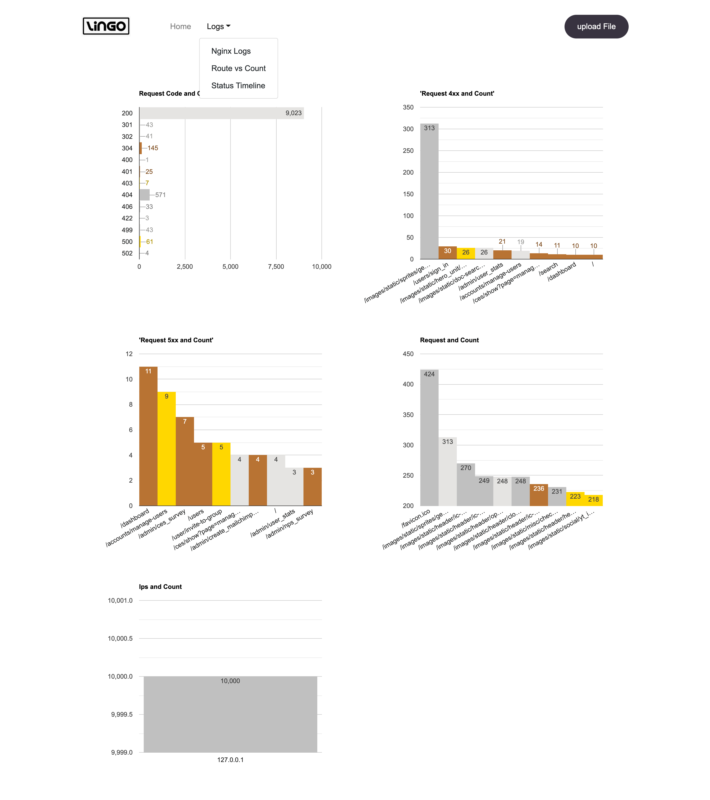
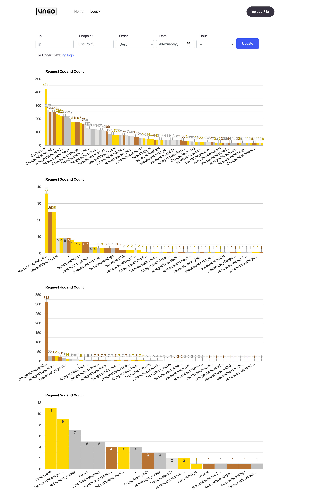

# Lingo Logs Visualizer

Lingo logs is a free tool to visualize the nginx logs.

- **Nginx Logs supported format ** `'$remote_addr - $remote_user [$time_local] "$request" $status'`


<details>

## how to Start

1. Clone the repository:

```sh

$ git clone https://github.com/nkkumawat/nginx-logs-visualizer.git

```

2. Install node packages:

```sh

$ npm install

```

3. Start tool:

```sh

$ npm start

```

4. Use tool by clicking http://localhost:3001:

</details>


## How to use
### Request type - count
<p  align="center">
  
</p>

### Request Url - count

<p  align="center">
  
</p>

### Request timeline

<p  align="center">
  
</p>